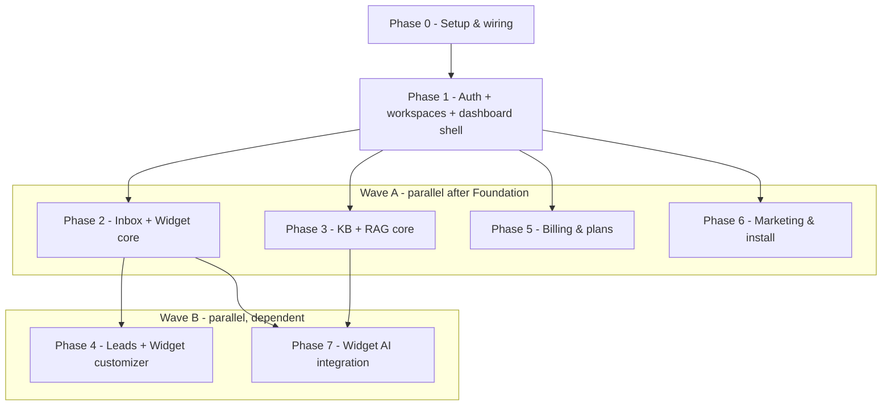

# Zencom: Phased Build Plan

Multi-tenant B2B support platform. Stack: Next.js 16 / React 19 / Tailwind v4 / shadcn, Convex backend, Clerk auth + seat-based org billing, OpenAI (`gpt-4o-mini` + `text-embedding-3-small`) via Convex Agent + RAG components. Both Clerk CLI and Convex CLI used for provisioning/debugging. Always verify against live Clerk/Convex docs and installed skills at implementation time.

## Parallelization model

A sequential **Foundation** establishes the shared scaffolding (tenancy, auth wiring, schema/config skeletons, dashboard shell). It must merge to `main` first. After that, **Wave A** tracks are mutually independent and **Wave B** tracks depend only on specific Wave A tracks. Each track runs in its own git worktree and merges via PR; cross-track file overlaps (see "Expected merge points") are resolved at PR time, not by sequencing.

## Foundational Architecture

- Tenancy: **Clerk org = workspace**. Every Convex table carries `orgId` and an `by_org` index. All authed access goes through org-scoped custom function wrappers in `convex/lib/customFunctions.ts` (`orgQuery` / `orgMutation` / `adminMutation`) built on `convex-helpers`, per the project's custom-functions-for-auth rule.
- Auth wiring: `ConvexProviderWithClerk` added to `app/providers.tsx` and used in [app/layout.tsx](app/layout.tsx) (currently only `ClerkProvider`); `convex/auth.config.ts` referencing the Clerk JWT issuer (Clerk "convex" JWT template).
- Clerk -> Convex sync: a Convex HTTP route in `convex/http.ts` verifies Clerk webhooks (`organization.*`, `organizationMembership.*`, `user.*`, billing `subscription.*` / `subscriptionItem.*`) and mirrors workspaces/members/subscription state into Convex so backend authz, presence, and gating work without round-tripping Clerk.
- Public widget path: `public/embed.js` injects an iframe pointing at `/widget`; anonymous visitors use public Convex functions validated by a per-workspace `publicKey` + a visitor session token (localStorage). This keeps unauthenticated traffic strictly tenant-isolated.
- Convex components: `@convex-dev/agents` (Agent), RAG component, `@convex-dev/persistent-text-streaming` (token streaming), `@convex-dev/rate-limiter` (quota/rate limits), optionally `@convex-dev/migrations` and `@convex-dev/aggregate` (live counts/badges). Registered in `convex/convex.config.ts`.
- Conventions enforced throughout: argument + return validators, `withIndex` (no `.filter`), pagination for conversations/leads, `"use node"` only for PDF parse + OpenAI actions, schedule only `internal.*`, no `Date.now()` in queries.

## Decisions locked

- AI provider: OpenAI (`gpt-4o-mini`, `text-embedding-3-small`).
- Sequencing: sequential Foundation, then parallel Wave A + Wave B across worktrees.
- Plans: Free / Pro / Enterprise, all self-serve via `<PricingTable for="organization" />`, using Clerk **seat-based** (per-seat) org billing.
- Membership mode: B2B-only (Membership required, `hidePersonal`); roles `org:admin` (gates KB, customizer, billing, team) and `org:member`.

## FOUNDATION (sequential - merge first)

### Phase 0 - Setup & wiring (prerequisite)

- Install + init shadcn/ui; base theme tokens, layout primitives.
- Add `ConvexProviderWithClerk`; create `convex/auth.config.ts`; create Clerk "convex" JWT template.
- Scaffold `convex/schema.ts`, `convex/lib/auth.ts` (`getCurrentUser`), `convex/lib/customFunctions.ts`, and empty `convex/convex.config.ts` + `convex/http.ts` skeletons so Wave A tracks extend rather than create them (minimizes merge conflicts).
- `clerk enable orgs` (Membership required); set `OPENAI_API_KEY` in Convex env via `npx convex env set`.
- Run `npx convex dev` to validate codegen.

### Phase 1 - Auth + multi-tenant workspaces + dashboard shell

- Tables: `workspaces` (orgId, name, publicKey, settings), `members` (orgId, userId, role).
- Onboarding: org create -> provision `workspaces` row (webhook `organization.created` + idempotent first-load upsert).
- Dashboard layout: sidebar nav (extensible registry so tracks add their own nav entries), `<OrganizationSwitcher hidePersonal />`, team management page (admin-gated via `has({ role: 'org:admin' })`), role-gated nav.
- Launchable: sign up, create workspace, invite members, switch orgs.

## WAVE A (parallel - each its own worktree/PR, depends only on Foundation)

### Phase 2 - Real-time team inbox + embeddable widget (human chat only)

- Tables: `conversations` (orgId, status open/closed, assigneeId, visitorId, lastMessageAt, unread), `messages` (conversationId, authorType visitor/agent, body), `visitorSessions` (orgId, token, lead fields later), `presence`/`typing`.
- Widget v1: `embed.js` + `/widget` iframe, launcher, send/receive, real-time via Convex subscriptions.
- Inbox: two-pane (list + thread + composer); filters all/unread/unassigned/assigned-to-me; live presence + typing; assignment; open/closed; human takeover; live badges/feeds for new conversations.
- Launchable: embed on a test page, converse visitor<->agent in real time.

### Phase 3 - Knowledge base + RAG core (standalone)

- Install Agent + RAG + persistent-text-streaming components; extend `convex/convex.config.ts`.
- Tables: `articles` (orgId, title, slug, category, markdown, coverImage, popular, published), `documents` (orgId, source, status), `chunks`/embeddings via RAG component.
- Ingestion: upload `.md/.txt/.pdf` -> parse (PDF in `"use node"` action) -> chunk -> embed -> RAG store (scoped per orgId namespace).
- Help center: public searchable articles + clean reader.
- Standalone "ask KB" test surface in the dashboard (RAG retrieval + streaming answer with citations) to validate end-to-end without depending on the widget. Widget-embedded AI is deferred to Phase 7.
- Launchable: upload docs, manage articles, ask via the test surface and get cited streaming answers.

### Phase 5 - Billing & plans (Clerk seat-based)

- `clerk enable billing --for org`; define Free/Pro/Enterprise as **seat-based** Organization Plans + per-plan Features via `clerk config pull/patch` (`billing.json`).
- Pricing page `<PricingTable for="organization" />`; billing dashboard (`<OrganizationProfile />` or custom), admin-gated.
- Gating via `has({ plan })` / `has({ feature })` (reusable gate helpers other tracks import); quota metering tables + rate limiting via rate-limiter component. Quota enforcement is wired against real usage as the consuming tracks land (e.g. AI messages, KB docs) - Phase 5 ships the metering primitives and gates.
- Billing webhooks -> `convex/http.ts` (verify with `verifyWebhook`, sync plan/status to workspace).
- Launchable: subscribe via Clerk dev gateway, gates enforced per seat.

### Phase 6 - Marketing & install pages

- Animated landing page (showpiece), pricing page (comparison + FAQ), install/setup page with embed snippet. Public/unauthenticated.
- Pricing page embeds `<PricingTable for="organization" />`; if built before Phase 5 merges, ship with a static comparison + FAQ and drop in the live table on integration.

## WAVE B (parallel - depends on specific Wave A tracks)

### Phase 4 - Lead management + widget customizer (depends on Phase 2)

- Leads: capture form (name/email/phone) optionally gating chat; `leads` table with lifecycle new->contacted->closed; sortable/paginated table; filter status/source/search; inline status updates; CSV export.
- Widget customizer: appearance (colors, radius, margins, title, logo, position, sound) + behavior (proactive toggle+delay, lead capture, FAQ); persisted per workspace; live preview iframe; copy-paste install snippet; proactive messages on dwell delay.
- Launchable: customize widget, capture + manage + export leads.

### Phase 7 - Widget AI integration (depends on Phase 2 + Phase 3)

- Connect the Agent + RAG core into widget conversations: per-conversation Agent thread, RAG retrieval scoped to the workspace, token-by-token streaming with source citations rendered in the widget.
- Human takeover (from Phase 2) disables AI for that conversation; re-enable returns it to the agent.
- If Phase 5 merged, decrement AI-message quota per answer and enforce the gate.
- Launchable: visitor asks in the live widget, gets streaming cited answers, agent can take over.

## Expected merge points (resolved at PR time, not by sequencing)

- `convex/schema.ts` - each track appends its tables; keep additions in separate clearly-delimited blocks.
- `convex/convex.config.ts` - Phase 3 + Phase 5 register components.
- `convex/http.ts` - Phase 1 (org/user/member sync) + Phase 5 (billing) add webhook branches.
- Dashboard sidebar nav - each track registers its nav entries via the Phase 1 registry.
- `convex/lib/customFunctions.ts` / gate helpers - shared; treat as append-only.

## Open verification items (at implementation time)

- Confirm Clerk seat-based per-seat pricing config + any B2B add-on requirement for Enterprise via `clerk config pull --keys billing` and live docs.
- Confirm current Convex Agent/RAG streaming + citation API surface against installed Convex skills.
